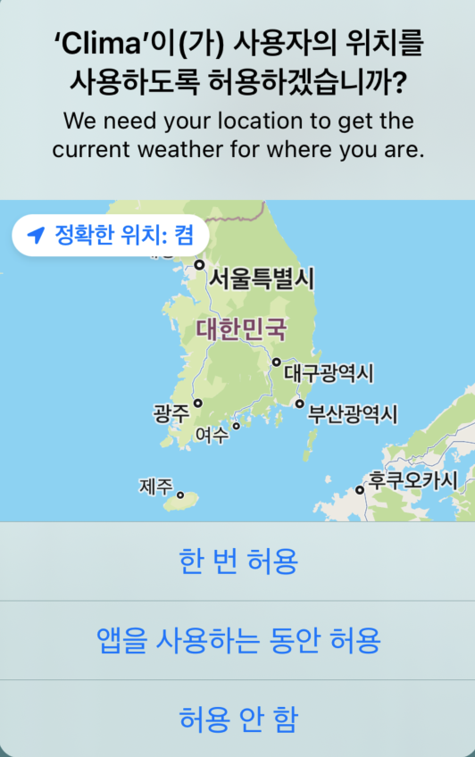

- [143: Dark Mode and Working with Vector Assets](#143-dark-mode-and-working-with-vector-assets)
  - [SF Symbols](#sf-symbols)
  - [dark mode](#dark-mode)
- [144: Learn to use the UITextField](#144-learn-to-use-the-uitextfield)
  - [UITextFieldDeligate](#uitextfielddeligate)
- [154. Internal and External Parameter Names](#154-internal-and-external-parameter-names)
- [155. Method Naming Conventions and Error Handling](#155-method-naming-conventions-and-error-handling)
- [156. Updating the UI by Using the DispatchQueue](#156-updating-the-ui-by-using-the-dispatchqueue)
- [157: [Swift Deep Dive] Extensions and Default Implementations for Protocols](#157-swift-deep-dive-extensions-and-default-implementations-for-protocols)
- [158: Using Extensions to Refactor the ViewController](#158-using-extensions-to-refactor-the-viewcontroller)
  - [section 나누기](#section-나누기)
  - [code snippet 만들기](#code-snippet-만들기)
- [159: Using CoreLocation to get Location Data](#159-using-corelocation-to-get-location-data)
  - [Challenge 1](#challenge-1)
    - [mine](#mine)
  - [Challenge 2](#challenge-2)
    - [mine](#mine-1)
  - [Challenge 3](#challenge-3)
    - [mine](#mine-2)
  - [Location 관련 웹페이지들](#location-관련-웹페이지들)
- [160. What is a Property List (.plist) ?](#160-what-is-a-property-list-plist-)
  - [The Property List or .plist](#the-property-list-or-plist)

# 143: Dark Mode and Working with Vector Assets

## SF Symbols

[SF Symbols](https://developer.apple.com/design/human-interface-guidelines/foundations/sf-symbols) provides thousands of consistent, highly configurable symbols that integrate seamlessly with the San Francisco system font, automatically aligning with text in all weights and sizes.

## dark mode

[Apple Doc](https://developer.apple.com/documentation/uikit/appearance_customization/supporting_dark_mode_in_your_interface)
Main.storyboard > 하단 중앙의 Dark mode 아이콘을 클릭하면 인터페이스가 바뀜

- How?
Color(Tint) 중 custom 말고 System, Label 등등이 붙은 거 선택하면 됨
- Custom Color도 Mode에 가변적으로 하고싶으면?
  - Assets.xcassets > + > Color Set > Appearances: Any, Light, Dark

- mode에 따라 바뀌는 Background Image
  - png 대신 pdf, vector 이미지 사용할 수 있다.
    - vector 이미지는 깍두기가 생기지 않음(they don't pixelate)
    - [ ] Resizing -> [x] Preserve Vector Data
    - [ ] Scales -> Single Scale

# 144: Learn to use the UITextField

- Learn to use the UITextField to get user input.
- interface builder - Text
- default로 interface 변화에 따른 색 변화 적용되어 있음
- Attr Inspecter > Text Input traits
  - Content Type: Unspecified
    - 내용 어떤 컨텍스트일지 모름
  - Capitalization: Words
    - 단어마다 첫 글자 대문자로
  - Return Key: Go
    - return key 누르면 할 액션: go
  - [ ] Secure Text Entry :
    - pw field처럼 입력 값을 *로 표시

- Placeholder

## UITextFieldDeligate

- 사용하려면
  - 아래와 같이 UITextFieldDeligate 프로토콜을 추가로 상속한다. 왜? 텍스트 필드 인풋 수정/검증을 더 편하게 관리할 수 있음

    ```swift
    import UIKit

    class WeatherViewController: UIViewController, UITextFieldDelegate {
        ...
        override func viewDidLoad() {
            ....        
            searchTextField.delegate = self
        }        
    }
    ```

  - `searchTextField.deligate = self`
    - text field가 self(=WeatherViewController)에게 report back 할거임(알아야 할 사항 알려줄거임)
      - 유저가 typing 시작했어! 그만뒀어! 텍스트 필드 말고 다른데 선택했어!
  - 위 2개를 하게 되면, textFieldShouldReturn(야 뷰컨아, 유저가 리턴키를 눌렀어. 뭐할래?) 과 같은 method를 사용할 수 있음
    - textFieldShouldReturn
      - 진짜 리턴할거임? return True
      - validation check 통과 실패 False

- 키보드 사라지게 하기
  - 키보드는 dismiss 하지 않는 이상 사라지지 않음
  - searchTextField.endEditing(true)

- 엔터 / 찾기 누른 후 텍스트 필드 비우기
  - 나는 그냥 `searchTextField.setValue("", forKey: "text")` 이걸 추가할 줄 알았는데
  - deligate가 또 나왔어요

    ```swift
    func textFieldDidEndEditing(_ textField: UITextField) {
        searchTextField.setValue("", forKey: "text")
    }
    ```

  - 해당 뷰의 어떤 텍스트 필드든 종료되면 이 함수가 호출된다.

- textFieldShouldEndEditing
  - Should: asking for permission. 뭐할까?
  - 이 함수로 user input validation 하기 좋음

  - 이전 함수는 searchTextField < 특정한 UITextField 를 집었지만, 이번 함수에선 일반적인 param으로 받아온 textField 를 활용. 왜? 보편적인 기능이므로.
  - textField는 어디에서 오는가? 메소드를 trigger하는 textField가 들어간다.
  -

# 154. Internal and External Parameter Names

```swift
// Defining the Function
func myFunc(external interal: Type) {
    print(interal)
}
            
// Calling the Function
myFunc(external: value)
            
// Defining the Function
func myFunc2(_ inter: Type) {
    print(inter)
}
            
myFunc2(value)
```

# 155. Method Naming Conventions and Error Handling

# 156. Updating the UI by Using the DispatchQueue

UILabel.text must be used from main thread only

- 그냥 함수 안에서 바로 label을 변경하면 앱 크래시
- <https://developer.apple.com/documentation/xcode/diagnosing-memory-thread-and-crash-issues-early>
- networking, 컴플리션 핸들러 등 같은 일들은 Background queue에서 일어남. 그래서 ui 이용하는 데 막힘 없게끔 하는거. 그런데 ui업데이트는 메인스레드에서 일어나야함. 그래야 끊김 없이 반응형 앱을 만들 수 있으니깐. 그래서 UI 업뎃 코드는 메인 큐에 넣어줘야함.

```swift
// 아래와 같이 그냥 업뎃하면 crash 생김
// self.temperatureLabel.text = weather.temperatureString
// APP Call stack: didUpdateWeather은 
// W_VC.textFieldDidEndEditing > weatherManager.fetchWeather > performRequest > session.DataTask의 completionHandler > didUpdateWeather 에서 불림.
DispatchQueue.main.async {
    // code...
}
```

# 157: [Swift Deep Dive] Extensions and Default Implementations for Protocols

- extensions.playground

# 158: Using Extensions to Refactor the ViewController

## section 나누기

아래와 같이 입력하면 메세지와 함께 section을 나눌 수 있다.

```swift
//MARK: - UITextFieldDelegete 
```

## code snippet 만들기

{} 아이콘
만드는 방법

- snippet으로 만드려는 부분 드래그로 선택 후 우클릭
- Create Code Snippet
  - <# ... #> 를 통해 코드 블럭을 만들 수 있다
  - completion 에 지정할 단축어를 입력한다.

# 159: Using CoreLocation to get Location Data

휴대폰의 GPS data 이용하기

1. import CoreLocation
2. create CLLocationManager object
   - 현재 휴대폰의 GPS 데이터
3. Use locationManager
   1. trigger permission request
      - viewDidLoad() 안에서 아래를 호출

        ```swift
          locationManager.requestWhenInUseAuthorization()
        ```

      - 로케이션 정보 써도 ㄱㅊ냐는 팝업창 두둥등장
   2. info.plist (:= property list) 에 add new property
      - key: Privacy - Location When In Use Usage Description
      - val: We need your location to get the current weather for where you are.
      - 효과: 팝업에 설정한 Description을 띄워줌
        
   3. request location
      - locationManager.requestLocation()
      - Requests the one-time delivery of the user's current location.
      - 이건 요청한 시각의 위치를 한 번만 반환한다.
      - 만약 운동앱이나 네비앱처럼 현재의 위치를 계속 업데이트해야 한다면 `startUpdatingLocation` method를 이용
      - return 값이 없음.
   4. didUpdateLocationDelegate

## Challenge 1
https://developer.apple.com/documentation/corelocation/cllocationmanagerdelegate
https://developer.apple.com/documentation/corelocation/getting_the_current_location_of_a_device
- [ ] didUpdateLocationDelegate 가 trigger됐을 때 print current location 
- [ ] extension으로 분리해서 didUpdateLocation method 구현하기
  - https://developer.apple.com/documentation/corelocation/cllocationmanager/1620548-requestlocation
  - 이 문서의 맨 마지막 참고
    > When using this method, the associated delegate must implement the locationManager(_:didUpdateLocations:) and locationManager(_:didFailWithError:) methods. Failure to do so is a programmer error.

  - 에러 처리 locationManager( : Error ) { 코드 }
  - location 정보 받은 후 처리 locationManager(_, didUpdate...: ...) { 코드 }
  - 위 2개를 다 구현해야 함.
  - delegate는 권한 체크 전에 할당해야 함. delegate 할당을 제일 먼저 해야한다. 

> A CLLocationManager object reports all location-related updates to its [delegate](https://developer.apple.com/documentation/corelocation/cllocationmanager/1423792-delegate) object, which is an object that conforms to the [CLLocationManagerDelegate](https://developer.apple.com/documentation/corelocation/cllocationmanagerdelegate) protocol. **Assign the delegate immediately when you configure your location manager**, because the system reports the app’s authorization status to the delegate’s locationManagerDidChangeAuthorization(_:) method after the location manager finishes initializing itself. Core Location calls the methods of your delegate object using the RunLoop of the thread on which you initialized the CLLocationManager object. That thread must itself have an active RunLoop, like the one found in your app’s main thread.

### mine
```swift
//MARK: - CLLocationManagerDelegate

extension WeatherViewController: CLLocationManagerDelegate {
    func locationManager(_ manager: CLLocationManager, didUpdateLocations locations: [CLLocation]) {
        print(locations[0].coordinate)
    }
    
    func locationManager(_ manager: CLLocationManager, didFailWithError error: Error) {
        print(error)
    }
}
```


- location의 last가 가장 최신 location, 비교적 제일 정확한 location일 것. 그런데 last 는 optional임. 그래서 optional binding해야 함.

## Challenge 2
didUpdateLocation 과 weatherManager 연결하기.    
fetchWeather(latitude:,longitude:) method를 추가로 구현하자.

### mine
```swift
// in weatherManager
func fetchWeather(latitude lat: Double, longitude lon: Double) {
    let urlString = "\(weatherURL)&lat=\(lat)&lon=\(lon)"
    performRequest(with: urlString)
}
```
- lat, lon의 데이터타입을 option+click을 이용해 살펴보아야 한다.

## Challenge 3
네비버튼 누르면 current location 날씨 업데이트 되도록 구현하기
### mine
```swift
@IBAction func navIconPressed(_ sender: UIButton) {
    locationManager.requestLocation()
}
```
1. IBAction 만들기
   1. locationPressed
      1. 첫 번째 방법은 requestLocation()을 호출하는 것.
         - 그런데 최초에 호출된 후 새로 호출했을 때 로케이션이 바뀌지 않으면 didUpdateLocations가 호출되지 않을 것이다?
         - 나는 왜 됐지?
         - requestLocation을 통해 didUpdateLocations 콜백이 실행되는 방향
      2. stopUpdatingLocations - hold a location
         - locationManager-didUpdateLocations 에서 locationManager.stopUpdatingLocation() 을 실행하면 location을 업데이트하지 않고 hold해둔다.
      <!-- 2. 최초에 location, weather 정보를 받아왔었음. 이걸 어디엔가 저장해서 활용하자. -->

+ `locationManager.stopUpdatingLocation()`

전체 시퀀스는 다음과 같다.
1. locationManager delegate 할당
2. call requestLocation
3. locationManagerDelegate - didUpdateLocations
4. location 찾은 후 stopUpdatingLocation - hold
5. location button을 눌렀을 때, requestLocation을 실행하면, locationManager는 다시 활성화되고 delegate method 역시 그러함.


## Location 관련 웹페이지들
- https://developer.apple.com/documentation/corelocation/cllocation
- [requestLocation()](https://developer.apple.com/documentation/corelocation/cllocationmanager/1620548-requestlocation)
- [CLLocationManagerDelegate](https://developer.apple.com/documentation/corelocation/cllocationmanagerdelegate)
- https://developer.apple.com/documentation/corelocation/cllocationmanagerdelegate/1423615-locationmanager
- https://developer.apple.com/documentation/corelocation/cllocationmanagerdelegate/1423786-locationmanager

- [Framework: MapKit](https://developer.apple.com/documentation/mapkit)
- [Location and Maps Programming Guide](https://developer.apple.com/library/archive/documentation/UserExperience/Conceptual/LocationAwarenessPG/Introduction/Introduction.html#//apple_ref/doc/uid/TP40009497-CH1-SW1)
- https://developer.apple.com/documentation/corelocation/getting_the_current_location_of_a_device
- https://developer.apple.com/documentation/corelocation/handling_location_updates_in_the_background


# 160. What is a Property List (.plist) ?
## The Property List or .plist
- xcode project에 자동으로 생성되는 파일
- configuration information for the application at runtime 저장함
- key-value fair
- https://developer.apple.com/library/archive/documentation/General/Reference/InfoPlistKeyReference/Articles/AboutInformationPropertyListFiles.html