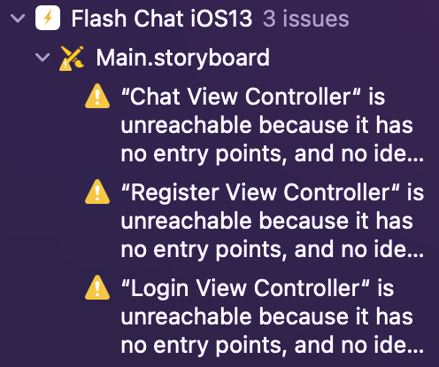
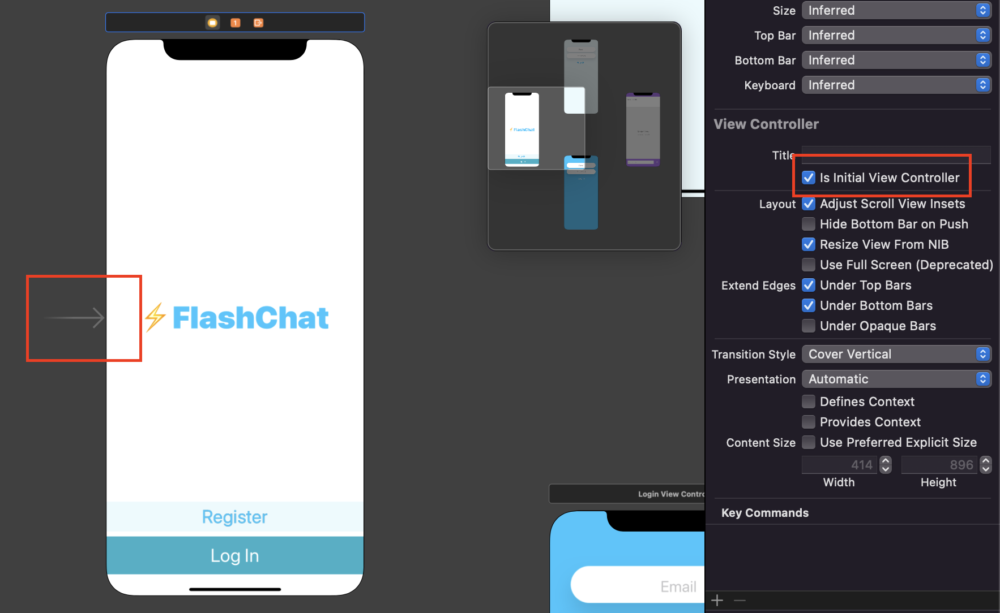
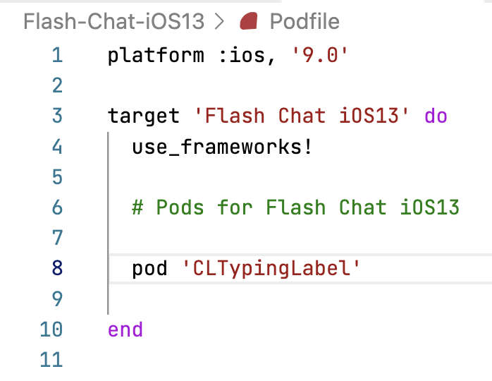
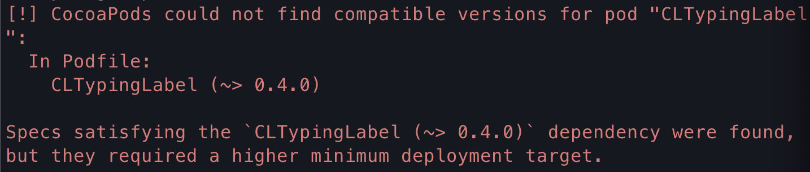
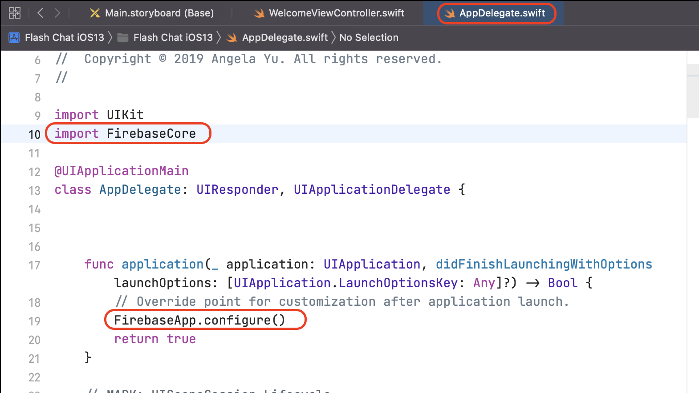
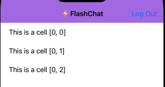
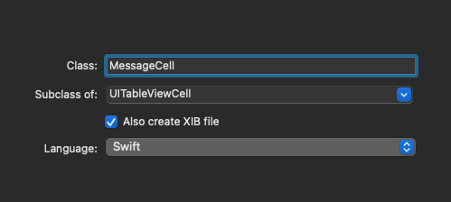
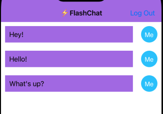
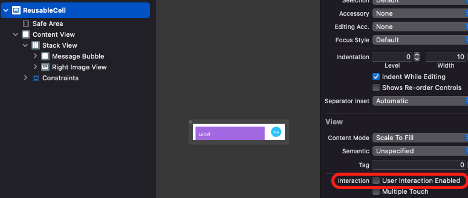

- [Sec. 15 - Firebase Cloud Firestore, TableViews and Cocoapod Dependencies](#sec-15---firebase-cloud-firestore-tableviews-and-cocoapod-dependencies)
  - [173. What You'll Make by the End of this Module](#173-what-youll-make-by-the-end-of-this-module)
    - [What you will learn](#what-you-will-learn)
  - [174. Navigation Controller Stacks and Segues](#174-navigation-controller-stacks-and-segues)
    - [Custom Asset](#custom-asset)
    - [Table View](#table-view)
    - [지금 존재하는 경고의 의미](#지금-존재하는-경고의-의미)
    - [Challenge](#challenge)
    - [Navigation Controller / Navigation Stack](#navigation-controller--navigation-stack)
  - [175. Typing Animations, Timers and For Loops](#175-typing-animations-timers-and-for-loops)
  - [176. [Swift Deep Dive] Loops](#176-swift-deep-dive-loops)
  - [176. Loops Coding Exercise](#176-loops-coding-exercise)
  - [177. Fibonacci Solution Code File](#177-fibonacci-solution-code-file)
  - [178. Introduction to 3rd Party Libaries](#178-introduction-to-3rd-party-libaries)
  - [179. Cocoapods Installation Instructions](#179-cocoapods-installation-instructions)
  - [180. How to Install a Pod to your Project](#180-how-to-install-a-pod-to-your-project)
  - [181. Potential Problems with Pod Installation](#181-potential-problems-with-pod-installation)
    - [Podfile에서 Pod 특정 버전 선택하기](#podfile에서-pod-특정-버전-선택하기)
  - [182. How to use the CLTypingLabel Pod](#182-how-to-use-the-cltypinglabel-pod)
    - [How to remove a Pod](#how-to-remove-a-pod)
  - [183. How to Choose your Package Manager](#183-how-to-choose-your-package-manager)
  - [184. Adding Firebase to your Project](#184-adding-firebase-to-your-project)
  - [185. Registering New Users](#185-registering-new-users)
    - [암호 기반 계정 만들기](#암호-기반-계정-만들기)
  - [186. Logging in Existing Users](#186-logging-in-existing-users)
  - [187. Logging Out Users](#187-logging-out-users)
    - [NavigationController?.popToRootViewController](#navigationcontrollerpoptorootviewcontroller)
    - [chat view에서 back 버튼을 지우고 싶다.(숨기고 싶다)](#chat-view에서-back-버튼을-지우고-싶다숨기고-싶다)
    - [Navi bar에 타이틀 추가](#navi-bar에-타이틀-추가)
  - [188. Using a Constants File and Understanding the static Keyword](#188-using-a-constants-file-and-understanding-the-static-keyword)
    - [Instance / Type Method, Properties](#instance--type-method-properties)
  - [189. How to use a UITableView and Create a Message Model](#189-how-to-use-a-uitableview-and-create-a-message-model)
    - [UITableView](#uitableview)
    - [Message Model 만들기](#message-model-만들기)
    - [TableView <- Message](#tableview---message)
    - [[prot] UITableViewDelegate](#prot-uitableviewdelegate)
  - [190. Customising Cells in a TableView using a .xib File](#190-customising-cells-in-a-tableview-using-a-xib-file)
    - [새 view 만들기](#새-view-만들기)
    - [조금 더 예쁘게 만들어보자](#조금-더-예쁘게-만들어보자)
  - [191. [Swift Deep Dive] Casting as? as! as is and understanding Any](#191-swift-deep-dive-casting-as-as-as-is-and-understanding-any)
    - [is](#is)
    - [as! : Forced Downcast](#as--forced-downcast)
    - [as?](#as)
    - [as: Sub -> Super: Upcast](#as-sub---super-upcast)
    - [Any, AnyObject, NSObject](#any-anyobject-nsobject)
  - [192. Database setup and Saving Data to Firestore](#192-database-setup-and-saving-data-to-firestore)
  - [193. Retrieving Data from Firestore](#193-retrieving-data-from-firestore)
  - [194. Listening for Updates on Firestore](#194-listening-for-updates-on-firestore)
    - [db.collection(K.FStore.collectionName).addSnapshotListener](#dbcollectionkfstorecollectionnameaddsnapshotlistener)
  - [195. How to Sort Data retrieved from Firestore](#195-how-to-sort-data-retrieved-from-firestore)
    - [Date().timeIntervalSince1970](#datetimeintervalsince1970)
    - [order](#order)
  - [196. How to Manage the Keyboard and use the Swift Package Manager](#196-how-to-manage-the-keyboard-and-use-the-swift-package-manager)
  - [197. Finishing Touches: UI and UX Improvements](#197-finishing-touches-ui-and-ux-improvements)
    - [첫 번째: Sender, Recipient 구분](#첫-번째-sender-recipient-구분)
    - [두 번째: Auto Scroll](#두-번째-auto-scroll)
    - [세 번째: Nav bar 커스터마이징](#세-번째-nav-bar-커스터마이징)
    - [TODO](#todo)
  - [198. The ViewController Lifecycle Explained](#198-the-viewcontroller-lifecycle-explained)
  - [199. The App Lifecycle Methods Explained](#199-the-app-lifecycle-methods-explained)
  - [200. Download the Completed App Project](#200-download-the-completed-app-project)
  - [201. Tip from Angela - Sleep is My Secret Weapon](#201-tip-from-angela---sleep-is-my-secret-weapon)

# Sec. 15 - Firebase Cloud Firestore, TableViews and Cocoapod Dependencies

## 173. What You'll Make by the End of this Module

### What you will learn

- How to integrate third party libraries in your app using Cocoapods and Swift Package Manager.
- How to store data in the cloud using Firebase Firestore.
- How to query and sort the Firebase database.
- How to use Firebase for user authentication, registration and login.
- How to work with UITableViews and how to set their data sources and delegates.
- How to create custom views using .xib files to modify native design components.
- How to embed View Controllers in a Navigation Controller and understand the navigation stack.
- How to create a constants file and use static properties to store Strings and other constants.
- Learn about Swift loops and create animations using loops.
- Learn about the App Lifecycle and how to use viewWillAppear or viewWillDisappear.
- How to create direct Segues for navigation.

## 174. Navigation Controller Stacks and Segues

Main.storyboard 에 4개의 화면이 있음.

### Custom Asset

- custom textfield
  - shadow가 있고 ... 이메일, 비번 칠 수 있는 칸. 그래서 더 퀄있는 앱 만들 수 있음.

- custom brand color

- ViewController
  - assistant에 보면 이미 linked up 해둠. 각각의 VC에.
  - 가끔 ~~.h가 자동으로 불러와질 때가 있는데, automatic 눌러서 직접 수정, 바인딩해주자.
  - create New view controller 후 main.storyboard에서 custom class에 연동하기.
  
### Table View

- 리스트로 보여줌

- vertically stack
- e.g. 메일, chat,
- 우리 챗 앱도 테이블 뷰 바탕으로 custom view 만들거야

### 지금 존재하는 경고의 의미



- 뷰 연결을 안해서.
- main.storyboard의 뷰 왼쪽에 있는 -> 화살표가 가리키는 화면이 첫 화면임
- 

### Challenge

- Register View Controller와 Chat View Controller 사이에 Segue 만들기

- Login View Controller와 Chat View Controller 사이에 Segue 만들기
- viewContoller 아이콘 + 컨트롤 드래그 to 연결할 뷰 : show
- 버튼 + 컨트롤 드래그 to 연결할 뷰 : show

### Navigation Controller / Navigation Stack

문제 상황: 버튼 + show를 하니 modal로 뜬다. 이거 말고 아예 화면을 대체한 후 네비게이션 바가 있으면 좋겠다.
Root VC 클릭 후 editor > Embed in > Navigation Controller

- screen의 top에 nav bar가 생긴다. 바의 왼쪽에는 back 버튼이 생긴다.

버튼을 눌러서 활성화되는 segue는 identifier가 필요없다. 그러나 login -> chat, register -> chat은 코드로 활성화시켜야 하기 때문에 identifier가 필요하다.

## 175. Typing Animations, Timers and For Loops

FlashChat이라는 애니메이션 만들거임
letter 별로

- for loop
- 타이머 추가

## 176. [Swift Deep Dive] Loops

## 176. Loops Coding Exercise

## 177. Fibonacci Solution Code File

## 178. Introduction to 3rd Party Libaries

## 179. Cocoapods Installation Instructions

1. sudo gem install cocoapod
2. pod setup --verbose
3. pod --version
   1. install check

## 180. How to Install a Pod to your Project

1. Project Parent Folder로 이동 (xcodeproj 파일이 있는 곳)
2. pod init
   - Podfile 생성됨
3. Podfile 열기
   - Ruby로 작성된 파일임
   - 여는 방법
     1. finder에서 우클릭 > Open with.. > Other.. > Xcode + 항상 이 app으로 열기 체크
   - platform :
     - 최소 버전
     - 지원하는 os
4. pod 추가
   - comment와 end 사이에 README 를 참고해 pod을 추가한다.
   - 
   - <https://cocoapods.org/>
5. pod install
   - m1 맥북 에어 사용 시 pod install error 발생
     - [이 글](https://ondemand.tistory.com/340) 보고 해결함
6. xcworkspace 외 파일 생성됨
   - xcodeproj 파일이 아니라 xcworkspace 파일을 사용해야.

## 181. Potential Problems with Pod Installation

pod 설치하면서 나타날 수 있는 오류들과 그 해결

- how pods are updated?
- how to specify a particular version of the pod using Podfile

처음 xcworkspace 열자마자 cmd+b로 빌드해보면 빌드 실패한다. 왜? pod install하면서 추가된 코드들 중 수정해야 하는 부분이 있을 수 있음.

- 해당 팟의 깃헙 [풀 리퀘 이력](https://github.com/cl7/CLTypingLabel/pulls?q=is%3Apr+is%3Aclosed)을 참고하여 코드를 고쳐보자.

- wd의 Podfile.lock을 보면 설치된 pod의 정보를 알 수 있음
  - 최신 버전은 0.4.0인데 현재는 0.3.0임

### Podfile에서 Pod 특정 버전 선택하기

```ruby
platform :ios, '8.0'
use_frameworks!

target 'MyApp' do
  pod 'AFNetworking', '~> 2.6'
  pod 'ORStackView', '~> 3.0'
  pod 'SwiftyJSON', '~> 2.3'
end
```

- 버전 수정 후 다시 pod install하면 아래와 같은 Error을 확인할 수 있음
- 
  - 0.4.0 버전은 지금 minimum deployment target(9.0)보다 더 높은 최소 사양을 요구함.
  - 10.0으로 변경하니 해결됨
  - [pod 스펙](https://github.com/cl7/CLTypingLabel/blob/master/CLTypingLabel.podspec) 확인 하면 mdt 확인 가능
최신 pod 받으니 에러가 사라지고 build 성공

## 182. How to use the CLTypingLabel Pod

github documentation 보면 사용법 나와있음

1. UILabel -> CLTypingLabel class 바꾸기
2. vc 파일에 import CLTypingLabel
3. label.text = 'asdf' 할당하기

### How to remove a Pod

1. pod 사용하기 위해 변경했던 것들을 다시 되돌린다.
2. Podfile에서 지울 pod을 삭제한다
3. xcode 종료 후 터미널에서 pod install

firebase를 cocoapods로 할거니까 podfile을 삭제하지는 마세요.

## 183. How to Choose your Package Manager

- cocoapods의 유용성
  - Package Dependency Manager,
    - {moduleName}.podspec
  - 사용했던 libraries 업데이트하고 싶으면, wd에 가서
  - pod update

- cocoapods의 대체제
  - Carthage
  - SPD, Swift Package Manager
    - Package.swift
    - 2019년에는 지원하는 package가 많지는 않았음
    - 애플이 지원하는
    - cocoapods과 함께 쓰기 불편함
    - firebase도 이 당시에는 안됐는데 지금은 됨

## 184. Adding Firebase to your Project

[firebase 깃헙 레포](https://github.com/firebase/firebase-ios-sdk)

1. create new Firebase Project
   - [콘솔](https://console.firebase.google.com/)
2. App 추가 > iOS
3. 앱 등록: Xcode Project 정보 > Target > Bundle Id
4. config 파일 다운로드
   - 파일 이름이 중요하다. GoogleService-Info.plist 인지, 뒤에 덮어 쓰기 방지 용으로 postfix가 붙었는지 확인
5. 강의에서는 cocoapods로 진행했는데, 나는 SPM으로 해볼거임
   - cocoapods 프로젝트에서 제거하는 [방법](https://stackoverflow.com/questions/16427421/how-to-remove-cocoapods-from-a-project)
   - 강의에서는 auth, firestore만 추가했으므로, spm에서도 두 개만 추가함
6. 초기화 코드 추가 (이건 파이어베이스 콘솔 설명보고 진행하는 것)
   1. 앱이 시작될 때 Firebase에 연결하려면 아래의 초기화 코드를 앱의 기본 진입점에 추가합니다.
   - 
7. 빌드 후 오류 여부 확인
   - 의존하는 코드들이 많아져서 빌드하는데 꽤 오랜 시간이 걸린다 (1831...)

- [Firebase 문서](https://firebase.google.com/docs/guides?authuser=0&hl=ko)
- [Firebase 샘플](https://firebase.google.com/docs/samples?authuser=0&hl=ko)

## 185. Registering New Users

register - 이메일, 비밀번호 입력 후 register 버튼 누르면 firebase로 보내서 저장하게 할거임
이게 다 되면, 바로 Chat screen으로 이동하게 할거임

- [Firebase iOS 문서](https://firebase.google.com/docs/ios/setup?hl=ko&authuser=0)
- [Firebase 비밀번호 기반 Auth 문서](https://firebase.google.com/docs/auth/ios/password-auth?hl=ko&authuser=0)

1. Firebase 콘솔에서 이메일/비밀번호 로그인 활성화:

### 암호 기반 계정 만들기

1. AppDelegate.swift에서 import하기
2. ㄴ application method에서 configure()
3. View에서 사용자가 이메일/비밀번호 입력할 때 유효성 체크하기
4. VC에서 새 사용자의 이메일 주소와 비밀번호를 `createUserWithEmail:email:password:completion:` 에 전달하여 새 계정 만들기 (레지스터 버튼 눌렸을 때)

## 186. Logging in Existing Users

signIn method에서 [weak self]

- to avoid a retained cycle
closure가 끝나기 전에 해당 vc는 destroy됨

error 처리 정석은 error code switch해서 코드 별 대응 > 문서 확인
강의는 일단 print만 하는 걸로.

## 187. Logging Out Users

맨 위의 네비게이션 바 우측에 LogOut button을 추가한다.
유저가 이걸 눌렀을 때 로그아웃을 진항핸다.

- Main.storyboard에서 Bar Button Item을 추가한다. Chat View - Navigation Item 안에 위치.
- 로그아웃 Button 누르면 로그아웃 + Welcome view로 이동
- test 편하게 하려면, login View 에서 input Text Field의 text에 미리 인증 정보를 입력하자.
- logOutPressed 안에서
  - logout이 성공했을 때
    - welcome View로 이동해야한다.

### NavigationController?.popToRootViewController

- navi stack의 root로 바로 가게 됨.

- 이걸 왜?
  - (login 된 상태) chat view에서 login 화면이 보이는 게 아니라 root로 바로 가고 싶으니까. 즉, 기존 스택을 없애고 싶음
  - 로그아웃 했을 때 root로 바로 가고 싶다. log in 화면을 스택에서 지우면서.

### chat view에서 back 버튼을 지우고 싶다.(숨기고 싶다)

- 왜?
  - Login, Regi 에서는 Back 있는게 합리적인데,
  - Chat view에서는 back 있을 필요 없음
    - 이건 App 만드는 사람이 UI/UX를 고려해 판단해야 할 문제
- 방법
  - viewDidLoad에 `navigationItem.hidesBackButton = true` 추가

  ```swift
    override func viewDidLoad() {
        super.viewDidLoad()
        navigationItem.hidesBackButton = true
    }
  ```

### Navi bar에 타이틀 추가

- 방법
  - viewDidLoad에 `title = \(titleName)` 추가

## 188. Using a Constants File and Understanding the static Keyword

perform segue 할 때, title 지정 등등 String 상수를 그대로 string으로 박아넣으면 너무 vulnerable하다. 이를 constant file로 만들어서 사용해보자.

- 왜?
  - 하지 않는다면 코드체킹 / 자동 완성이 안된다. 오타가 발생해도 모르고 넘어갈 위험이 있다.
- 방법
- app wd에 constant file을 만들자.

### Instance / Type Method, Properties

```swift

struct Constants {
    static let registerSegue = "RegisterToChat"
    static let loginSegue = "LoginToChat"
}

```

- [Properties](https://docs.swift.org/swift-book/LanguageGuide/Properties.html)
  - [TypeProperties](https://docs.swift.org/swift-book/LanguageGuide/Properties.html#ID264)

- [Methods](https://docs.swift.org/swift-book/LanguageGuide/Methods.html)
  - [TypeMethods](https://docs.swift.org/swift-book/LanguageGuide/Methods.html#ID241)

## 189. How to use a UITableView and Create a Message Model

### UITableView

테이블 뷰 입문을 위해 새로운 view Controller를 만들고 거기에 Table view를 추가해보자.
Key Component

- Table View
- Table View Cell
  - 이는 모든 cell의 프로토타입이 된다.
  - identifier
  - Style, Accessory 등으로 설정 가능

- Table View Controller
  - 테이블 뷰만 있는 뷰컨트롤러
  - 제한적
  - flash chat 프로젝트에서는 일반 뷰컨에 table view 추가함

### Message Model 만들기

create Message Structure: Model > Message.swift
messages: [Message] in chatViewController

### TableView <- Message

Message -> table cell로 어떻게 표현?

in ChatViewController...

- TableView outlet 연결
- adopt UITableViewDataSource protocol
  - How many rows/cells the tableView needs?
  - which cells that put into it?

```swift
func tableView(_ tableView: UITableView, cellForRowAt indexPath: IndexPath) -> UITableViewCell {
    // 여기서 cell을 만들고 table view cell을 return해야 함.
    let cell = tableView.dequeueReusableCell(withIdentifier: K.cellIdentifier, for: indexPath)
    // cell 데이터 추가하기
    // cell.textLabel?.text = "This is a cell \(indexPath)"
    // indexPath.row : Int
    cell.textLabel?.text = messages[indexPath.row].body
    return cell
}
```

- 

- Main.storyboard > Table View > Seperator 설정 가능

### [prot] UITableViewDelegate

```swift
class ChatViewController: UIViewController {
    override func viewDidLoad() {
        // ...
        tableView.delegate = self
        // ...
    }
}
// ...
extension ChatViewController: UITableViewDelegate {
    func tableView(_ tableView: UITableView, didSelectRowAt indexPath: IndexPath) {
        print(indexPath.row)
    }
}
```

cell 과 User 사이에 interaction이 있으면 delegate를 이용.
flash chat 에서는 사용하지 않음

- Main.storyboard - ReusableCell - Selection - None

## 190. Customising Cells in a TableView using a .xib File

custom ui view 만들고 거기에 message 넣을거임 - message bubble 만들기

### 새 view 만들기


Views > new Files... > cocoaTouch class > messageCell.swift + xib 파일 생성

- xib
  - 디자인 파일
  - 작업하기
    1. Add UIView and adjust
       1. 우측 좀 남겨두기
    2. change background color
       1. custom color: Brand Purple
    3. Add Label inside the UIView
    4. cell 우측에 ImageView 추가하기
       1. Content view 안에
       2. 유저 아바타 이미지 viewer
    5. 1, 4를 stack view로 감싸기
    6. ImageView에 constraint 추가
       1. width: 40
       2. height: 40
    7. Stack View에 constraint 추가
       1. 10 from every single edge
       2. relative from the content view
    8. Label에 constraint 추가
       1. 10 from every single edge
       2. relative from the view
    9. root view 크기 조절하기
    10. Stack view 간격 조정
        1. 20
    11. ImageView -> Me Avatar image 로 바꾸기
    12. messageCell.swift 와 Link 하기
    13. xib 파일의 messageCell identifier 설정
- swift
  - [method] awakeFromNib
    - nib은 xib의 이전 이름
    - xib 파일 내용대로 초기화

- 사용하기
  1. 사용하려는 View Controller의 viewDidLoad 메소드에서
     - `tableView.register(_ UINib:, forCellReuseIdentifier: )`
  2. DataSource extension 내 cell 생성 시
     - dequeueReusableCell method 리턴을 as! MessageCell 로 캐스팅
     - messageCell 내 label property로 text 변경
  3. main.storyboard에 있는 기존 reuseable cell은 더 이상 사용하지 않으므로 삭제한다.

- 현재 결과


### 조금 더 예쁘게 만들어보자

1. Label text color 변경
   1. black -> BrandLightPurple (custom)
2. bubble에 round corner 추가하기
   - radius 동적으로 변경

   ```swift
        override func awakeFromNib() {
            super.awakeFromNib()
            messageBubble.layer.cornerRadius = messageBubble.frame.height / 5
        }
   ```

3. multiple line
   - 현재는 overflow는 ...로 truncate한다.
   - Label line property를 1-> 0
   - Stack view > alignment > Top
     - 메세지 버블이 길어져도 아바타는 항상 위에 위치 (기본값은 가운데)

## 191. [Swift Deep Dive] Casting as? as! as is and understanding Any

- Type Casting
- **keywoard** as, as?, as!, is

### is

- Type check할 때 사용

```swift
let cell = UITableViewCell()
if cell is UITableViewCell {
    print("The types match!")
}
```

### as! : Forced Downcast

- super class -> sub class로 강제로 다운캐스팅
- 문제: downcasting 하려는 subclass가 object의 subclass가 아닌 경우 runtime error 발생 (compile 시 잡지 못함)
- 어떤 타입인지 명확할 때 사용

```swift
let messageCell = cell as! MessageCell
```

### as?

- super class -> sub class로 강제로 다운캐스팅
- 문제: downcasting 하려는 subclass가 object의 subclass가 아닌 경우 runtime error 발생 (compile 시 잡지 못함)

```swift
if let messageCell = cell as? MessageCell {
    // Then can use messageCell's capabilities

}
```

### as: Sub -> Super: Upcast

- is used to raise a object to its superclasses type.
- 제대로 하면 sub -> super는 fail할 일이 없으므로 !와 ?는 없음
- downcasting보다는 자주 사용하지 않음

```swift
let newCell = messageCell as UITableViewCell
```

### Any, AnyObject, NSObject

- flexible
- data type을 한정짓고 싶지 않을 때
- Any
  - encompasses all objects, so objects derived from classes, from structs.
- AnyObject: Any
  - objects derived from classes
  - class가 하는 행위로 제한하려면 AnyObject로..? 추가 필요

- [타입 캐스팅](https://docs.swift.org/swift-book/LanguageGuide/TypeCasting.html)

## 192. Database setup and Saving Data to Firestore

- [firebase Docs](https://firebase.google.com/docs/firestore/quickstart)
- 방법
  1. Create new Database
     - <https://console.firebase.google.com/project/${projectName}/firestore>
     - 2 종류의 데이터 베이스 [차이](https://firebase.google.com/docs/database/rtdb-vs-firestore)
        1. cloud database
           - 이번 모듈에서 배울 것!
        2. realtime database
     1. Select Secure rules: Test mode
     2. Select location:
        - 서비스 User가 많지 않으면 위치는 영향을 적게 줌
        - 일반적으로 단말 유저와 서버의 위치가 가까울 수록 좋음
        - 위치 별로 과금 정책이 다름
        - 어차피 데이터 많지 않으니 지금은 기본값인 US로 하자
  2. Set up your development environment [참고](https://firebase.google.com/docs/firestore/quickstart#ios+)
     - 난 SPM으로 설치 완
  3. Initialize Cloud Firestore [참고](https://firebase.google.com/docs/firestore/quickstart#swift)
     - AppDelegate.swift 에 init
  4. Add Data [참고](https://firebase.google.com/docs/firestore/quickstart#swift_1)
     1. messageBody
     2. sender
        1. Auth - get user info [참고](https://firebase.google.com/docs/auth/ios/manage-users#swift_2)
        - `Auth.auth().currentUser?.email`
     3. add 시 Error 발생
        - Missing or insufficient permissions.
        - DB 규칙 write를 허용하니 해결됨
        - [해결](https://fomaios.tistory.com/entry/Firebase-Error-%ED%95%B4%EA%B2%B0%EB%B2%95-%ED%8F%AC%ED%95%A8-Missing-or-insufficient-permissions)
        - 위 글처럼 true로 바꾸면 누구나 읽고 쓸 수 있는 보안 상 허점이 생김
        - 그러면 어떻게 변경해야 할까?
        - 공식 문서의 [보안 규칙](https://firebase.google.com/docs/firestore/security/get-started)을 토대로 수정하자
        - if `request.auth != null`

## 193. Retrieving Data from Firestore

Firestore에서 데이터 읽어와서 message fetch하기

1. Read Data [참고](https://firebase.google.com/docs/firestore/quickstart#swift_3)

    - querySnapshot [이란](https://firebase.google.com/docs/reference/swift/firebasefirestore/api/reference/Classes/QuerySnapshot)?
    - data() 는 [String:Any] 타입이므로
    - 불러온 데이터로 새로운 기존 모델에 맞춰 새 obj 만드려면 type casting을 해야 한다.
    - network 이슈로 fetch는 table view 그릴 때 보다 더 늦게 완료될 수도 있다. 이 경우 원하는대로 동작하지 않는다.
    - 데이터를 불러온 후 다시 table view를 그리는 method

      ```swift
      DispatchQueue.main.async {
          self.tableView.reloadData()
      }
      ```

새로운 chat을 보내면 화면에 추가 안되는 걸 수정할 것임
-> 전체 데이터 새로 불러오기?
-> Firebase의 변화를 감지하고 변화한 부분만 가져오기

## 194. Listening for Updates on Firestore

### db.collection(K.FStore.collectionName).addSnapshotListener

[참고](https://firebase.google.com/docs/firestore/query-data/listen)

그런데 메세지 순서가 이상해.
왜?
랜덤으로 생성된 id 오름차순으로 정렬되기 때문

## 195. How to Sort Data retrieved from Firestore

- time 정보 추가 후 추가 시간 순으로 ordering하기

### Date().timeIntervalSince1970

return UTC Timestamp : TimeInterval = Double

### order

- [참고 1](https://firebase.google.com/docs/firestore/query-data/order-limit-data)
- [참고 2](https://firebase.google.com/docs/firestore/query-data/queries)
  - 이 문서 보고 ref가 collections(...) 임을 깨달음

## 196. How to Manage the Keyboard and use the Swift Package Manager

- 문제: textInputField을 터치하면 키보드가 올라와서 Field가 보이지 않음.
- 해결
  1. keyboard height를 계산 후 height만큼 view를 끌어올림
     - 기기마다 keyboard 높이가 다르다. 그러므로 높이 하드코딩은 비추
     - 키보드가 올라오면 OS로부터 알림을 받자. 그 후 keyboard  정보를 받아오자
     - 3rd party libraries 이용
     - IQKeyboardManager
       - [github](https://github.com/hackiftekhar/IQKeyboardManager.git)
       - AppDelegate.swift 에서 추가 및 설정

         ```swift
         IQKeyboardManager.shared.enable = true
         IQKeyboardManager.shared.enableAutoToolbar = false
         IQKeyboardManager.shared.shouldResignOnTouchOutside = true
         ```

       - bubble 눌러도 gray 안생기게 하려면, disable user interaction
         
       - Xcode > Add Packages 할 때 오류가 생김
         - 기본적으로 2.0.0을 불러오는데,
         - 직접 version 선택해서 6.5.0 불러오면 해결
         - [참고한 글](https://github.com/hackiftekhar/IQKeyboardManager/issues/1859)

## 197. Finishing Touches: UI and UX Improvements

개선할 점

1. 또 다른 user. Me, You
2. 메세지 새로 보내면 scroll 자동으로 올라가게
3. 로그인 시 스크롤 맨 아래로 이동
4. customize the  navigation bar
   1. different background color
   2. different font size
   - of logout and title text
5. Welcome View에서는 hide nav bar

### 첫 번째: Sender, Recipient 구분

- idea
  - datasource protocol의 tableView method에서 sender가 user와 같다면 me, Recipient가 user와 같다면 you
- 방법
    1. 2개의 cell 만들기
    2. 1개의 cell을 활용하기 v
       1. xib에 2개의 image view를 만든 후, 필요에 따라 하나를 숨긴다.
       2. assistant에서 left image view 연결 후,
       3. chatViewController에서 숨기기

### 두 번째: Auto Scroll

- idea
  - snapshotListener 안에서 scroll 하자
- 방법
  - indexPath 생성하기
    - row
      - 마지막 index: messages.count - 1
    - section
      - ios 설정을 보면 section이 나뉘어진 것을 확인할 수 있다.
      - 현재 앱에서는 나뉘어져 있지 않으므로 0(첫 섹션)
  - `self.tableView.scrollToRow(at:, at:, animated:)`

- message send 후 text input field 초기화하기
  - sendPressed method 안에 로직 추가
    - UI 변경이므로 + background closure 안에서 실행하므로 업뎃 코드는
    - Dispatchqueue.main.async 안에 넣자.

### 세 번째: Nav bar 커스터마이징

- idea:
  - chat view nav bar 변경
    - 배경 색 바꾸기
    - 타이틀 폰트 바꾸기

- 방법
  1. 배경 색 바꾸기
     - main.storyboard > Navigation Controller Scene 에서 변경
       - Bar Tint
         - nav bar background color
       - Translucent unchecked
         - nav bar background color가 실제 view background color와 동일하게 되도록...
       - Tint
         - Back button text color
  2. 일부 view 에서 nav bar 안보이게 하기
     - Welcome view controller 에서
       - viewWillAppear
         - hide nav
       - viewWillDisappear
         - show nav
     - VC의 LifeCycle

### TODO

- 왜 bar tint가 안먹을까..?
  - [ ] 해결해보기
  - [참고](https://developer.apple.com/forums/thread/682420)

## 198. The ViewController Lifecycle Explained

## 199. The App Lifecycle Methods Explained

## 200. Download the Completed App Project

## 201. Tip from Angela - Sleep is My Secret Weapon
